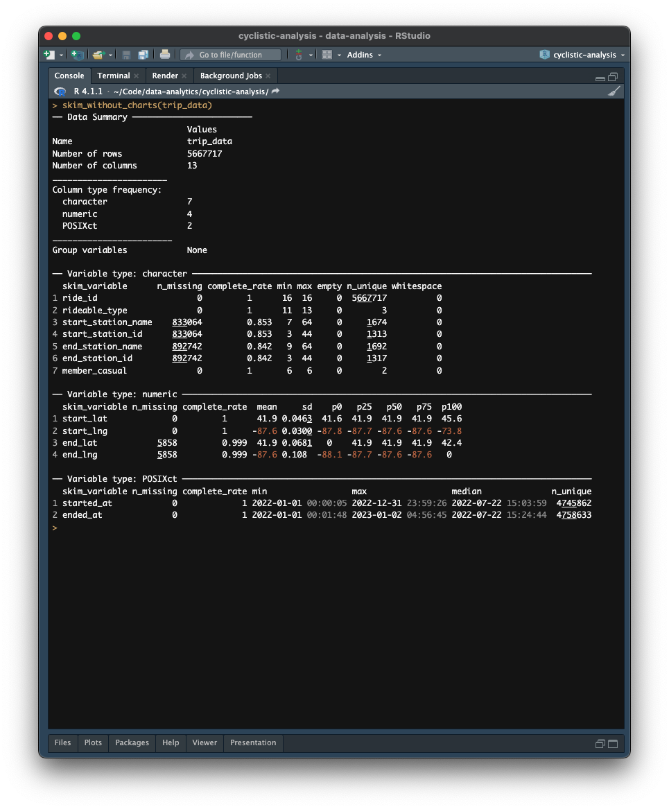
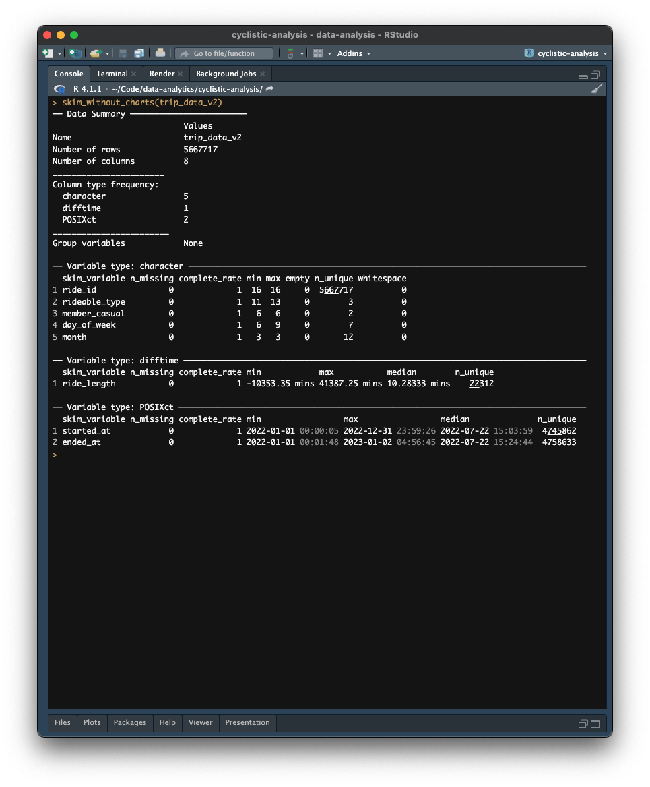

```{r setup, include=FALSE}
# Set root directory
knitr::opts_knit$set(root.dir = "/Users/thanakorn.tha/Code/data-analytics/cyclistic-analysis")

# Set chunk options
knitr::opts_chunk$set(
  echo = FALSE,
  message = FALSE,
  warning = FALSE,
  fig.align = "center",
  fig.asp = 0.80,
  fig.width = 6,
  out.width = "70%"
)
```

```{r load-packages}
library(tidyverse)
library(skimr)
library(janitor)
library(scales)
```

```{r theme_ggplot2, echo = FALSE}
# Creating a ggplot2 theme
theme_nun <- function(base_size = 14) {
  theme_bw(base_size = base_size) %+replace%
    theme(
      # Figure
      plot.title = element_text(size = rel(1), face = "bold", margin = margin(0, 0, 10, 0), color = "#343434", hjust = 0),
      plot.subtitle = element_text(size = rel(0.80), margin = margin(0, 0, 10, 0), color = "#343434",  hjust = 0),
      plot.caption = element_text(size = rel(0.70), face = "italic", margin = margin(5, 0, 5, 0), color = "#343434",  hjust = 0),
      # Graph area
      panel.grid.minor = element_blank(),
      panel.grid.major.x = element_blank(),
      panel.border = element_blank(),
      # Axis
      axis.title = element_text(size = rel(0.60), face = "bold", color = "#343434", hjust = 1),
      axis.text = element_text(size = rel(0.55), color = "#343434"),
      axis.line.x = element_line(color = "#343434"),
      axis.ticks.x = element_line(color = "#343434"),
      axis.line.y = element_blank(),
      axis.ticks.y = element_blank(),
      # Legend
      legend.title = element_blank(),
      legend.text = element_text(size = rel(0.60)),
      legend.position = "top",
      legend.key = element_rect(fill = "transparent", colour = NA),
      legend.key.size = unit(1, "lines"),
      legend.background = element_rect(fill = "transparent", colour = NA),
      legend.margin = margin(0, 0, 0, 0),
      # The labels (faceting)
      strip.background = element_rect(fill = "#343434", color = "#343434"),
      strip.text = element_text(size = rel(0.80), face = "bold", color = "white", margin = margin(5, 0, 5, 0))
    )
}

# Changing the default theme
theme_set(theme_nun())
```

\let\oldsection\section
\renewcommand\section{\clearpage\oldsection}

# Intoduction

This section provides an overview of Cyclistic's company detail and its current problem. 

## Problem Statement

Cyclistic is a successful American bicycle-sharing program that was established in 2016. Since then, the program has grown to a fleet of 5,824 bicycles that are geotracked and locked into a network of 692 stations across Chicago. The bikes can be unlocked from one station and returned to any other station in the system at any time.

Cyclistic's marketing strategy has primarily focused on building general awareness and appealing to broad consumer segments. The program offers a variety of pricing plans, including single-ride passes, full-day passes, and annual memberships. Cyclistic classifies its riders into the following groups based on these plans: *casual riders* (users who purchase single-ride passes or full-day passes) and *annual members* (users who purchase an annual membership).

Cyclistic's flexible pricing plans attract a larger customer base, but financial analysts have determined that annual members are more profitable. However, casual riders are already aware of the Cyclistic program and have chosen Cyclistic to meet their mobility needs. This suggests that a marketing campaign that targets existing customers is likely to be more effective at expanding the business than a campaign that targets only new customers.

Therefore, Cyclistic's marketing analytics team is interested in understanding how casual riders and annual members use Cyclistic bikes differently. By understanding these differences, the marketing analytics team can develop more targeted marketing strategies to convert casual riders into annual members.

## Purpose

The purpose of the report is to analyze Cyclistic's historical bike trip data from January 2022 to December 2022 in order to identify how annual members and casual riders use Cyclistic bikes differently. It also aims to extract insights and develop the most appropriate marketing strategies that appeal to casual riders and encourage them to subscribe to annual memberships. 

# Dataset

This section provides a comprehensive overview of the dataset used in the analysis. In order to understand the insights, it is essential to understand the data that has contributed to shaping the findings. This section also aims to ensure that the analysis is based on reliable information, making our conclusions strong and trustworthy. 

## Dataset Overview

The primary dataset used in the project is Cyclistic's historical trip data from January 2022 to December 2022. The data is collected by the City of Chicago (a government agency) and published by Cyclistic. It contains the historical trip data since 2013, whic can be found and downloaded in the following details:

- Data Source: [Trip History Data](https://divvy-tripdata.s3.amazonaws.com/index.html)
- Data Website: [System Data Website](https://divvybikes.com/system-data)
- License: [Data License Agreement](https://ride.divvybikes.com/data-license-agreement)

The data was downloaded and stored in ZIP files on the secure location. After extracting files, there are twelve CSV files, one for each month of 2022, including *202201-divvy-tripdata.csv* through *202212-divvy-tripdata.csv*. 

## Data Dictionary

Each dataset contains the following fields:

Column                  Data Type          Definition                                 Possible Value
--------------------    ---------------    ----------------------------------------   ---------------
ride_id                 String             Unique ID number for all rides             -
rideable_type           String             Type of bikes                              3
started_at              Date/Time          Which date and time the ride started       -
ended_at                Date/Time          Which date and time the ride ended         -
start_station_id        String             ID number of the stating station           -
start_station_name      String             Name of the the stating station            -
end_station_id          String             ID number of the ending station            -
end_station_name        String             Name of the the ending station             - 
start_lat               Float              Latitude of the stating location           -  
start_lng               Float              Longitude of the ending location           - 
end_lat                 Float              Latitude of the stating location           -
end_lng                 Float              Longitude of the ending location           -
member_casual           String             Type of users                              2
--------------------    ---------------    ----------------------------------------   ---------------

## Data Credibility

The data is evaluated for bias and credibility using the ROCCC method:

Name                   Rating       Reason
--------------------   ----------   ---------------------------------------------------------------------------
Reliable               High         Data includes useful information, such as location, date and user type 
Original               High         Data comes from the first-party provider, provided by the company
Comprehensive          Medium       Data has missing values in some columns
Current                High         Data has been updated monthly since 2013
Cited                  High         Data contains data process method and license from the company
--------------------   ----------   ---------------------------------------------------------------------------

Overall, the data is considered a credible source for analysis based on the Reliability, Originality, Comprehensiveness, Current, and Citation (ROCCC) method. The data can be used to explore how different customer types use Cyclistic bikes. For example, the data can be used to determine which customer segments are most likely to use Cyclistic bikes for commuting, recreation, or transportation. The data can also be used to identify trends in bike usage, such as the time of day when bikes are most likely to be used or the types of bikes that are most popular.

While there are some restrictions on rider's personal information, there is still a great deal of information that can be learned from it. However, the data needs to be processed before analysis can be performed. This includes cleaning the data to remove errors and inconsistencies, and transforming the data into a format that is suitable for analysis. The data processing will be performed in the next section.

# Data Cleaning and Manipulation

This section provides a documentation of data cleaning and manipulation. This process uses the ***R programming language*** and  ***RStudio*** integrated development environment (IDE) to complete the following tasks, including loading the packages, importing and combining the data, cleaning the data, transforming the data and removing outliers. R script is available on the [GitHub repository](https://github.com/thanakorntha/cyclistic-analysis/tree/main/scripts/data-cleaning).

## Loading the Packages

To perform the data cleaning process, it requires the following packages: 

- `tidyverse` for importing, wrangling and visualizing the data
- `skimr` for skimming the data
- `janitor` for exploring and cleaning the data
- `scales` for converting from data values to perceptual properties

## Importing and Combining the Data

```{r import-data}
# Import and merge the data
trip_data <- list.files(path = "./data/", pattern = "*-divvy-tripdata.csv", full.names = TRUE) %>%
  lapply(read_csv) %>%
  bind_rows %>%
  arrange(started_at)
```

After loading all necessary packages, it is important to import all 12-month data and then merge them into a single data, called ***trip_data***. 

```{r preview-data-1}
trip_data %>%
  head(1) %>%
  t() %>%
  knitr::kable()
```

## Cleaning the Data

From the result of the `skim_without_charts()` function, it provides a summary of the ***trip_data*** data. It contains `r prettyNum(count(trip_data), big.mark = ",")` rows and `r prettyNum(ncol(trip_data))` columns. It also shows that the unique number of rows of `ride_id` is `r prettyNum(length(unique(trip_data$ride_id)), big.mark = ",")` rows, which is the same as the total number of rides. Therefore, it can be concluded that there are no duplicate values in the data.  

{width="100%"}

The picture also reveals that the table has 13 columns of 3 data types: 7 **character**, 4 **numeric**, and 2 **POSIXct**. 6 columns have missing values, as follows:

- `start_station_name` (`r prettyNum(sum(is.na(trip_data$start_station_name)), big.mark = ",")` rows)
- `start_station_id` (`r prettyNum(sum(is.na(trip_data$start_station_id)), big.mark = ",")` rows)
- `end_station_name` (`r prettyNum(sum(is.na(trip_data$end_station_name)), big.mark = ",")` rows)
- `end_station_id` (`r prettyNum(sum(is.na(trip_data$end_station_id)), big.mark = ",")` rows)
- `end_lat` (`r prettyNum(sum(is.na(trip_data$end_lat)), big.mark = ",")` rows)
- `end_lng` (`r prettyNum(sum(is.na(trip_data$end_lng)), big.mark = ",")` rows)

```{r clean-data}
# Create a new data frame with the desired columns
trip_data_v2 <- trip_data %>%
  select(ride_id, started_at, ended_at, rideable_type, member_casual)
```

There are multiple ways to handle missing data, but in this case, it was decided to remove those columns as they contains many missing values and are not required for this analysis. Finally, the ***trip_data_v2*** data has only 5 columns, including `ride_id`, `started_at` and `ended_at`, `rideable_type`and `member_casual`.

## Transforming the Data

```{r add-new-columns}
# Calculate the difference between the two times and store it as the 'ride_length' variable
trip_data_v2$ride_length <- as.double(difftime(trip_data_v2$ended_at, trip_data_v2$started_at, units = "mins"))

# Extract the day of the week from the 'trip_data_v2$started_at' column
trip_data_v2$day_of_week <- wday(trip_data_v2$started_at, label = TRUE)

# Extract the month of the year from the 'trip_data_v2$started_at' column
trip_data_v2$month <- format(trip_data_v2$started_at, "%b")
```

The next step is to add three new columns to the data, called `ride_length`, `day_of_week`, and `month`, in order to facilitate data analysis and visualization. 

- The `ride_length` column will store the duration of the trip in minutes
- The `day_of_week` column will store the day of the week on which the trip was taken
- The `month` column will store the month in which the trip was taken

```{r preview-data-2}
trip_data_v2 %>%
  head(1) %>%
  t() %>%
  knitr::kable()
```

## Removing Outliers

```{r remove-outliers}
# Remove the rows with error ride lengths
trip_data_v2 <- trip_data_v2[!(trip_data_v2$ride_length < 1 | trip_data_v2$ride_length > 1440), ]

# Remove the rows that contain docked_bike in rideable_type
trip_data_v2 <- trip_data_v2 %>%
  filter(!grepl("docked_bike", rideable_type))
```

The last step is to remove unwanted data out of the table. The `skim_without_charts()` function is used to provides a concise summary of the ***trip_data_v2*** data again. It shows that there are minus number in the minimum values (min) in the `ride_length` column. There are also higher number with `r prettyNum(max(trip_data_v2$ride_length), big.mark = ",")` mins in the `ride_length` column. This means that there are outliers in the data. Outliers can distort the results of an analysis, so that it is important to remove them before proceeding. 

In this case, all trip data that were less than 60 seconds were filtered out. These trips are likely to be false starts or users attempting to re-dock a bike to ensure its security. Trips that exceeded a period of 24 consecutive hours were also removed. This is because these trips are likely to be the result of the rider not returning the bike.

{width="100%"}

The picture also shows that there are unique values in the `rideable_type` column. After checking, there are `classis_bike`, `electric_bike`, and `docked_bike`. Because there are only `classis_bike` and `electric_bike`, `docked_bike` needed to be remove from the data. The data is completely processed and is ready for the data analysis. The data contains `r prettyNum(count(trip_data_v2), big.mark = ",")` rows and `r prettyNum(ncol(trip_data_v2))` columns.

# Data Analysis

```{r setup-2}
# Convert the 'day_of_week' column to a factor variable with a specified level order
trip_data_v2$day_of_week <- ordered(
  trip_data_v2$day_of_week,
  levels = c("Mon", "Tue", "Wed", "Thu", "Fri", "Sat", "Sun")
)

# Order the levels of the month from January to December
trip_data_v2$month <- ordered(
  trip_data_v2$month,
  levels = c("Jan", "Feb", "Mar", "Apr", "May", "Jun", "Jul", "Aug", "Sep", "Oct", "Nov", "Dec")
)

# Define function to calculate mode
find_mode <- function(x) {
  u <- unique(x)
  tab <- tabulate(match(x, u))
  u[tab == max(tab)]
}
```

This section presents an analysis of Cyclistic's historical trip data from January 2022 to December 2022, with the objective of identifying the differences in the use of Cyclistic bikes between annual members and casual riders. The R script used for this analysis is available on the [GitHub repository](https://github.com/thanakorntha/cyclistic-analysis/tree/main/scripts/data-analysis).

## Overall Summary of Cyclistic Rides in 2022

As shown in the below table, it presents a statistical summary of time duration for Cyclistic's users, including casual riders and annual members.

```{r summarize-descriptive-statistics}
# Create descriptive statistics by the 'ride_length' column
trip_data_v2 %>% 
  summarize(
    Mean = mean(ride_length),
    Min = min(ride_length),
    Mode = find_mode(ride_length),
    Median = median(ride_length),
    Max = max(ride_length),
    SD = sd(ride_length),
    Size = n(),
    Popular_Day = find_mode(day_of_week)
  ) %>%
  knitr::kable()
```

The time duration of Cyclistic's rides can also be visualized by a histogram. The histogram shows that the distribution of ride times is positively skewed, with a high cluster of lower values and a spread-out tail on the right. This means that there are a few rides that are much longer than the majority of rides.

 
```{r plot-distribution-duration-all}
# Create a histogram
plot_time_all <- ggplot(trip_data_v2, aes(x = ride_length)) +
  geom_histogram(color = "black", fill = "darkgray") +
  scale_x_continuous(limits = c(0, 40)) +
  scale_y_continuous(limits = c(0, 600000), labels = unit_format(unit = "k", scale = 1e-3), expand = c(0, 0)) +
  theme(axis.line.x = element_line(arrow = grid::arrow(length = unit(0.10, "cm"), type = "closed"))) +
  labs(
    x = "Time duration (min.)",
    y = "Number of rides",
    title = "Distribution of rides at a time duration"
  )

# Add annotation for plot_time_all
plot_time_all +
  # Median
  geom_vline(xintercept = median(trip_data_v2$ride_length), linetype = "dashed", size = 0.50, color = "red") +
  annotate(
    "text", label = "Median:\n10.25",
    x = median(trip_data_v2$ride_length), y = 600000,
    vjust = 1.25, hjust = -0.25,
    size = 2.50, color = "red"
  ) +
  # Mean
  geom_vline(xintercept = mean(trip_data_v2$ride_length), linetype = "dashed", size = 0.50, color = "blue") +
  annotate(
    "text", label = "Mean:\n15.54",
    x = mean(trip_data_v2$ride_length), y = 600000,
    vjust = 1.25, hjust = -0.25,
    size = 2.50, color = "blue"
  ) +
  # Mode
  geom_vline(xintercept = find_mode(trip_data_v2$ride_length), linetype = "dashed", size = 0.50, color = "darkgreen") +
  annotate(
    "text", label = "Mode:\n5.38",
    x = find_mode(trip_data_v2$ride_length), y = 600000,
    vjust = 1.25, hjust = -0.25,
    size = 2.50, color = "darkgreen"
  ) +
  # Standard Deviation
  geom_vline(xintercept = sd(trip_data_v2$ride_length), linetype = "dashed", size = 0.50, color = "purple") +
  annotate(
    "text", label = "SD:\n25.07",
    x = sd(trip_data_v2$ride_length), y = 600000,
    vjust = 1.25, hjust = -0.25,
    size = 2.50, color = "purple"
  )
```

Because of the positive skew, the mean ride time is not a very accurate measure of the typical ride time. The median ride time is a more accurate measure, as it is not as affected by the outliers. So, the median ride time will be chosen to conduct further descriptive analysis.

\newpage

## Casual Riders vs Annual Members

```{r define-user-variables}
# Group the data by the 'member_casual' column, calculating stats for each group
stats_user <- trip_data_v2 %>%
  group_by(member_casual) %>%
  summarize(
    mean_ride_length = mean(ride_length),
    median_ride_length = median(ride_length),
    min_ride_length = min(ride_length),
    max_ride_length = max(ride_length),
    sd_ride_length = sd(ride_length),
    ride_count = n()
  )
```

Casual riders appear to ride for longer periods of time than annual members. The median time duration for casual riders is 13.27 minutes, which is higher compared to the median time duration of 9.03 minutes for annual members. However, the data also shows that casual riders took a total of 2,269,498 rides, while annual members took 3,271,770 rides. From these findings, it can be concluded that annual members tend to be more regular users of the bike-sharing service. On the other hand, casual riders are more likely to take longer trips when they do use the service, even though they use it less frequently.

 
```{r plot-bar-duration-user}
# Create a bar chart
plot_time_01 <- ggplot(stats_user, aes(x = member_casual, y = median_ride_length, fill = member_casual)) +
  geom_bar(stat = "identity", color = "black") +
  scale_y_continuous(limits = c(0, 15), expand = c(0, 0)) +
  scale_x_discrete(labels = c("Casual", "Member")) +
  theme(legend.position = "none") +
  labs(
    x = "User type",
    y = "Time duration (min.)",
    title = "Median time duration on bikes, by user type"
  )

# Add annotation for plot_time_01
plot_time_01 +
  # Text label for bar chart
  geom_text(aes(label = round(median_ride_length, 2)), position = position_dodge(width = 0.90), vjust = 2) +
  # Annotation for value difference
  annotate(
    "segment",
    x = 2,
    xend = 2,
    y = (12.55 / 1.03),
    yend = (9.03 * 1.03),
    arrow = arrow(ends = "both", angle = 90, length = unit(0.25, "cm")),
    color = "red"
  ) +
  annotate("text", label = "± 3.52 min.", x = 2, y = 10.79, hjust = -0.20, color = "red")
```
 
```{r plot-bar-count-user}
# Create a bar chart
plot_ride_01 <- ggplot(stats_user, aes(x = member_casual, y = ride_count, fill = member_casual)) +
  geom_bar(stat = "identity", color = "black") +
  scale_y_continuous(limits = c(0, 4000000), labels = unit_format(unit = "M", scale = 1e-6), expand = c(0, 0)) +
  scale_x_discrete(labels = c("Casual", "Member")) +
  theme(legend.position = "none") +
  labs(
    x = "User type",
    y = "Number of rides",
    title = "Total number of rides, by user type"
  )

# Add annotation for plot_ride_01
plot_ride_01 +
  # Text label for bar chart
  geom_text(aes(label = prettyNum(ride_count, big.mark = ",")), position = position_dodge(width = 0.90), vjust = 2) +
  # Annotation for value difference
  annotate(
    "segment",
    x = 1,
    xend = 1,
    y = (3271770 / 1.03),
    yend = (2095577 * 1.03),
    arrow = arrow(ends = "both", angle = 90, length = unit(0.25, "cm")),
    color = "red"
  ) +
  annotate("text", label = "± 1,176,193", x = 1, y = 2683673.50, hjust = -0.20, color = "red")
```

## Day of Week

```{r define-user-day-variables}
# Group the data by 'member_casual' and 'day_of_week' columns, calculating stats for each group
stats_user_day <- trip_data_v2 %>%
  group_by(member_casual, day_of_week) %>%
  summarize(
    mean_ride_length = mean(ride_length),
    median_ride_length = median(ride_length),
    min_ride_length = min(ride_length),
    max_ride_length = max(ride_length),
    sd_ride_length = sd(ride_length),
    ride_count = n(),
    .groups = "drop"
  )
```

Casual riders tend to take longer bike rides than annual members, especially on the weekend. On average, casual riders spend about 15 minutes longer on bikes than annual members on the weekend, but annual members take time cycling at a consistent level throughout the day. In contrast, annual members use Cyclistic bikes more frequently on the weekday and their usage gradually decreases as the weekend approaches. Casual riders, on the other hand, tend to take more bike rides on weekends. This suggests that the longer ride times of casual riders are highly correlated with their increased usage during the weekends.

 
```{r ride-length-user-day}
# Create a bar chart
plot_time_02 <- ggplot(stats_user_day, aes(x = day_of_week, y = median_ride_length, fill = member_casual)) +
  geom_bar(stat = "identity", position = "dodge", color = "black") +
  scale_y_continuous(limits = c(0, 20), expand = c(0, 0)) +
  scale_fill_discrete(labels = c("Casual", "Member")) +
  labs(
    x = "Day of week",
    y = "Time duration (min.)",
    title = "Median time duration on bikes, by user type and \nday of week"
  )

# Add annotation for plot_time_02
plot_time_02 +
  # Text label for bar chart
  geom_text(aes(label = round(median_ride_length, 2)), position = position_dodge(width = 0.90), hjust = -0.10, angle = 270) +
  # Median line
  geom_hline(yintercept = median(trip_data_v2$ride_length), color = "darkgray", linetype = "dashed", size = 0.50) +
  annotate(
    "text",
    label = "Median:\n10.52",
    x = 7,
    y = median(trip_data_v2$ride_length),
    vjust = -0.50,
    hjust = -0.25,
    size = 2.50,
    color = "darkgray"
  )
```
 
```{r ride-count-user-day}
# Create a bar chart
plot_ride_02 <- ggplot(stats_user_day, aes(x = day_of_week, y = ride_count, fill = member_casual)) +
  geom_bar(stat = "identity", position = "dodge", color = "black") +
  scale_y_continuous(limits = c(0, 600000), labels = unit_format(unit = "k", scale = 1e-3), expand = c(0, 0)) + 
  scale_fill_discrete(labels = c("Casual", "Member")) +
  labs(
    x = "Day of week",
    y = "Number of rides",
    title = "Total number of rides, by user type and day of week"
  )

# Add annotation for plot_ride_02
plot_ride_02 +
  # Text label for bar chart
  geom_text(aes(label = prettyNum(ride_count, big.mark = ",")), position = position_dodge(width = 0.90), hjust = -0.10, angle = 270)
```

## Hour

```{r define-user-hour-variables}
# Group the data by 'member_casual' and 'hour' columns, calculating stats for each group
stats_user_hour <- trip_data_v2 %>% 
  mutate(hour = as.numeric(format(started_at, "%H"))) %>% 
  group_by(member_casual, hour) %>% 
  summarize(
    mean_ride_length = mean(ride_length), 
    median_ride_length = median(ride_length), 
    min_ride_length = min(ride_length),
    max_ride_length = max(ride_length), 
    sd_ride_length = sd(ride_length), 
    ride_count = n(), 
    .groups = "drop"
  )
```

Casual riders are most likely to take longer bike rides after the midday hours, from 1 PM to 3 PM. After that, their usage decreases slightly. Annual members, on the other hand, take time on bikes at a consistent level throughout the day, with no significant spikes or dips in usage. By the number of rides, annual members use Cyclistic bikes at a consistent rate throughout the day, with three peaks in usage: at 8 AM, at 12 PM, and at 5 PM, whereas casual riders start using Cyclistic bikes at 5 AM and gradually increase their usage until they peak at 5 PM.

 
```{r plot-line-duration-user-hour}
# Create a line chart
plot_time_03 <- ggplot(stats_user_hour, aes(x = hour, y = median_ride_length, group = member_casual)) +
  geom_line(aes(color = member_casual), size = 1) +
  geom_point(aes(color = member_casual), size = 1) +
  scale_x_continuous(limits = c(0, 23), breaks = seq(0, 23, 1)) +
  scale_y_continuous(limits = c(0, 20), expand = c(0, 0)) +
  scale_color_discrete(labels = c("Casual", "Member")) +
  labs(
    x = "Hour",
    y = "Time duration (min.)",
    title = "Median time duration on bikes, by user type and hour"
  )

# Add annotation for plot_time_03
plot_time_03 +
  # Median line
  geom_hline(yintercept = median(trip_data_v2$ride_length), color = "darkgray", linetype = "dashed", size = 0.50) +
  annotate(
    "text",
    label = "Median: 10.52",
    x = 23,
    y = median(trip_data_v2$ride_length),
    vjust = -0.75,
    hjust = 0.70,
    size = 2.50,
    color = "darkgray"
  )
```
 
```{r plot-line-count-user-hour}
# Create a line chart
plot_ride_03 <- ggplot(stats_user_hour, aes(x = hour, y = ride_count, group = member_casual)) +
  geom_line(aes(color = member_casual), size = 1) +
  geom_point(aes(color = member_casual), size = 1) +
  scale_x_continuous(limits = c(0, 23), breaks = seq(from = 0, to = 23, by = 1)) +
  scale_y_continuous(limits = c(0, 400000), labels = unit_format(unit = "k", scale = 1e-3), expand = c(0, 0)) +
  scale_color_discrete(labels = c("Casual", "Member")) +
  labs(
    x = "Hour",
    y = "Number of rides",
    title = "Total number of rides, by user type and hour"
  )

# Add annotation for plot_ride_03
plot_ride_03 +
  # Hightlight
  annotate("rect", xmin = 8, xmax = 17, ymin = 0, ymax = 400000, alpha = 0.10, fill = "darkorange") +
  geom_vline(xintercept = c(8, 12, 17), linetype = "dashed", size = 0.50, color = "darkorange")
```

## Month

```{r define-user-month-variables}
# Group the data by 'member_casual' and 'month' columns, calculating stats for each group
stats_user_month <- trip_data_v2 %>% 
  group_by(member_casual, month) %>% 
  summarize(
    mean_ride_length = mean(ride_length), 
    median_ride_length = median(ride_length), 
    min_ride_length = min(ride_length), 
    max_ride_length = max(ride_length), 
    sd_ride_length = sd(ride_length), 
    ride_count = n(), 
    .groups = "drop"
  )
```

The findings show that the median ride time for both casual and member riders is relatively consistent throughout the year, with the exception of three months: March, April and May. However, casual riders tend to spend more time on bikes than annual members. They also shows that the number of Cyclistic rides increases from month to month, with a peak in July for casual riders and August for annual members. After that, the number of rides suddenly declines. This can be concluded that 

 
```{r plot-line-duration-user-month}
# Create a line chart
plot_time_04 <- ggplot(stats_user_month, aes(x = month, y = median_ride_length, group = member_casual)) +
  geom_line(aes(color = member_casual), size = 1) +
  geom_point(aes(color = member_casual), size = 1) +
  scale_y_continuous(limits = c(0, 20), expand = c(0, 0)) +
  scale_color_discrete(labels = c("Casual", "Member")) +
  labs(
    x = "Month",
    y = "Time duration (min.)",
    title = "Median time duration on bikes, by user type and month"
  )

# Add annotation for plot_time_04
plot_time_04 +
  # Median line
  geom_hline(yintercept = median(trip_data_v2$ride_length), color = "darkgray", linetype = "dashed", size = 0.50) +
  annotate(
    "text",
    label = "Median: 10.52",
    x = 12,
    y = median(trip_data_v2$ride_length),
    vjust = -0.75,
    hjust = 0.70,
    size = 2.50,
    color = "darkgray"
  )
```
 
```{r plot-line-count-user-month}
# Create line chart
plot_ride_04 <- ggplot(stats_user_month, aes(x = month, y = ride_count, group = member_casual)) +
  geom_line(aes(color = member_casual), size = 1) +
  geom_point(aes(color = member_casual), size = 1) +
  scale_y_continuous(limits = c(0, 500000), labels = unit_format(unit = "k", scale = 1e-3), expand = c(0, 0)) +
  scale_color_discrete(labels = c("Casual", "Member")) +
  labs(
    x = "Month",
    y = "Number of rides",
    title = "Total number of rides, by user type and month"
  )

# Add annotation for plot_ride_04
plot_ride_04 +
  # Highlight
  annotate("rect", xmin = 7, xmax = 8, ymin = 0, ymax = 500000, alpha = 0.10, fill = "darkorange") +
  geom_vline(xintercept = c(7, 8), linetype = "dashed", size = 0.50, color = "darkorange")
```

# Conclusion

This section provides concluding thought and recommendations of this report

## Key Findings

Based on the data collected, it can be concluded that 

- **Casual riders:** They are more likely to use Cyclistic bikes for leisure purpose, including enjoyment, fitness, exploring, and much more. They spend longer periods of time and have a higher number of rides on **weekends**. They take a ride throughout the day, but have higher rides at the evening.
- **Annual members:** They tend to use Cyclistic bikes for specific purpose, such as commute to work. They spend shorter periods of time and have a higher number of rides on **weekdays**. They take a ride during rush hour , especially at 8 AM, 12 PM, and 5 PM. 
- **Warmer months:** Both casual riders and annual members take more rides during Spring (in the beginning of March) and peak usage at the end of Summer (July and August).

## Recommendations

The report makes the following recommendations:

1. **Price Incentives:** Offer incentives for casual riders to become annual members, such as discounts, free ride credits, or gift cards. This would make it a more attractive option for casual riders who are not sure if they will use Cyclistic bikes enough to justify the full annual membership price.
2. **Personalized Marketing:** Personalize the marketing messages that we send to casual riders. This will help to ensure that we are reaching them with the right message at the right time. For example, we could send a message to casual riders who have taken a certain number of rides in a month, or who have used Cyclistic bikes during rush hour. 
3. **New Member Plans:** Consider to add a monthly or quarterly membership option. It would also be a good option for casual riders who only bike during certain times of the year, such as springtime and summertime.

## Further Analysis

This analysis is highly focused on data and time, time spent on bikes and total number of rides. However, it is the opportunity to use additional data to improve marketing strategy in the next analysis, such as demographic area, location, weather, and customer's feedback.